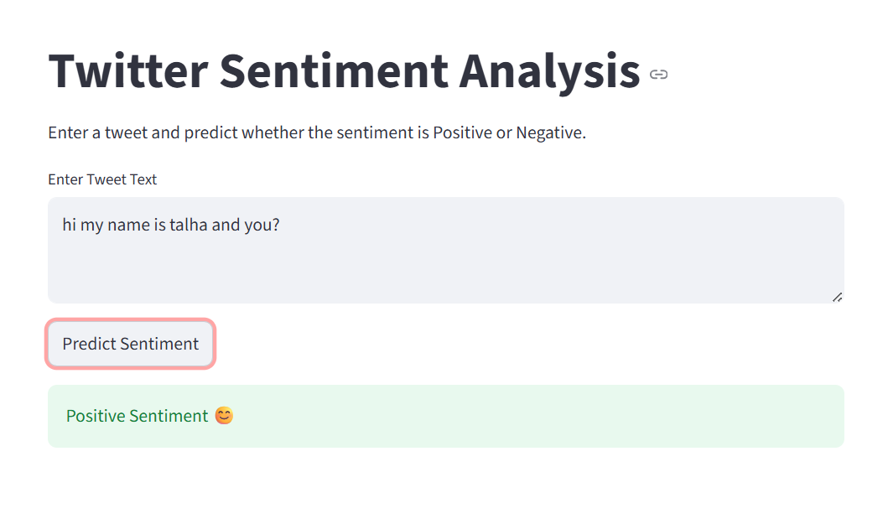

# 🐦 Twitter Sentiment Analysis using Machine Learning

## 📌 Project Overview
This project is a **Twitter Sentiment Analysis system** that classifies tweets as **Positive or Negative** using Natural Language Processing (NLP) and Machine Learning techniques.  
A Streamlit web app is built for real-time prediction.

---

## 🚀 Features
- Text preprocessing (cleaning, stemming, stopwords removal)
- TF-IDF feature extraction
- Machine Learning model (Logistic Regression)
- Real-time sentiment prediction using Streamlit
- Simple and interactive UI

---

## 📊 Dataset
- **Sentiment140 Dataset (Kaggle)**
- Contains 1.6 million tweets labeled as:
  - 0 → Negative sentiment
  - 4 → Positive sentiment

---

## ⚙️ Technologies Used
- Python
- Pandas
- NLTK
- Scikit-learn
- TF-IDF Vectorizer
- Streamlit

---

## 🧠 Machine Learning Pipeline
1. Data Loading  
2. Data Cleaning  
3. Stemming & Preprocessing  
4. Train-Test Split  
5. TF-IDF Vectorization  
6. Logistic Regression Model Training  
7. Model Evaluation  

---

## 📈 Model Performance
- Accuracy: **(Add your accuracy here, e.g. 82% - 88%)**

---

## Project Structure

```text
Twitter-Sentiment-Analysis/
│
├── README.md
├── requirements.txt
│
├── app/
│   ├── app.py
│   ├── sentiment_model.pkl
│   └── tfidf_vectorizer.pkl
│
├── notebooks/
│   ├── 01_data_loading.ipynb
│   ├── 02_data_preprocessing.ipynb
│   └── 03_model_training.ipynb
│
├── images/
│   └── app_screenshot.png
```

## 📸 Demo Streamlit Screenshot


---

## ▶️ How to Run Project

### 1️⃣ Install dependencies
```bash
pip install -r requirements.txt

2️⃣ Run Streamlit App
streamlit run app/app.py

📦 Requirements
streamlit
pandas
numpy
scikit-learn
nltk
```
## 👨‍💻 Author

**Talha Abbasi**

📧 Email: [talhaabbaci543@gmail.com](mailto:talhaabbaci543@gmail.com)

🐙 GitHub: [TalhaAbbasi-543](https://github.com/TalhaAbbasi-543)
